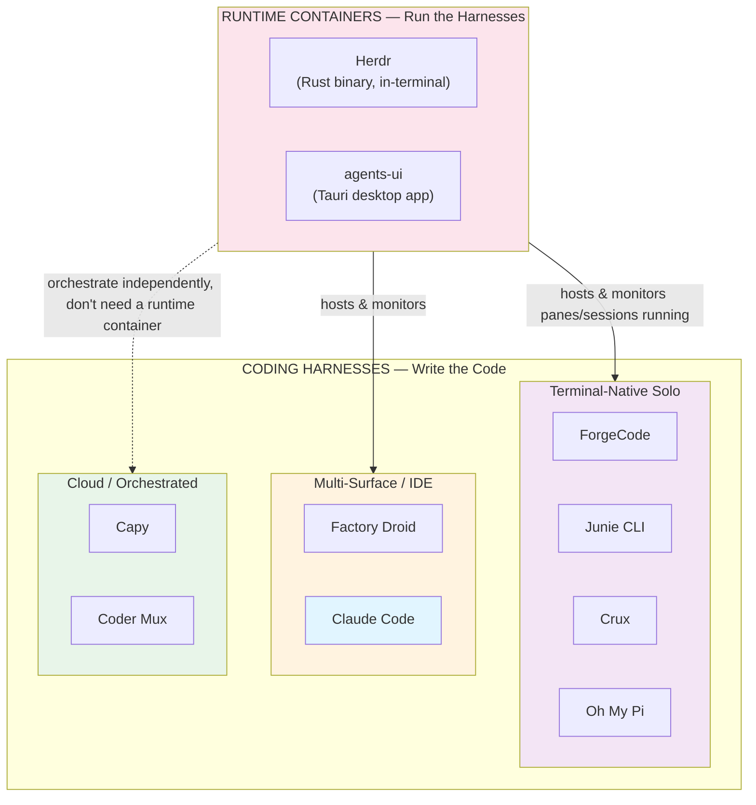

---
tags:
  - ai-tools
  - agentic-coding
  - agentic-harnesses
  - terminal-tools
  - developer-tools
  - claude-code
status: processed
created: 2026-04-08
updated: 2026-07-04
publish: true
summary: >
  A field guide to agentic coding tools, split into two categories that get conflated constantly: harnesses that actually write code (terminal-native, IDE-integrated, cloud/multi-agent) and runtime containers that orchestrate multiple harnesses in parallel.
related: ["[[OMP Configuration - Generic Reference]]", "[[Hindsight - Agentic Memory for AI Systems]]"]
---

# Agentic Coding Harnesses & Terminal Runtimes

Coding agents are LLM harnesses — wrappers that add structure, execution models, and integrations on top of a base model (usually Claude, GPT, Gemini, or a mix). They fall into two distinct categories that get conflated constantly:

1. **Coding harnesses** — tools that actually write code. They wrap an LLM with an interface (terminal, IDE, browser, chat), a context/indexing strategy, and an execution model (single agent, plan-then-apply, parallel subagents).
2. **Runtime containers / multiplexers** — infrastructure that sits *above* harnesses. They don't write code themselves; they run, monitor, and orchestrate one or more coding harnesses in parallel, tracking state (blocked/working/done/idle) across sessions.

Claude Code is one harness among several — not the reference point everything else gets measured against. It's covered below like any other tool: interface, features, trade-offs, best-for.

---

## Part 1: Coding Harnesses (Tools That Write Code)

### Terminal-Native Solo Agents

#### ForgeCode

**Interface:** Zsh-integrated shell agent. Activate with colon-command syntax (`: fix auth bug`, `: refactor database queries`). Press Tab to list available commands. Minimal TUI overlay; you stay in your terminal.

**Key Integrations:**
- 300+ LLM providers (Claude, GPT, Sonnet, Opus, etc.)
- Continuous indexing of repo + git history
- No external API calls — code stays on machine
- Nerd Font required for UI rendering

**Key Strengths:**
- **Context retention:** Maintains repository index across long sessions
- **Complete fixes:** Tends to deliver both logic *and* UX improvements, not just code changes
- **Local execution:** No code leaves your machine
- **Open source:** Community-driven, transparent, forkable
- **Seamless shell integration:** Fixes apply immediately, no context-switching

**Trade-offs:**
- CLI-only — no browser UI for non-terminal workflows
- Requires Nerd Font setup
- Smaller community than the big-name harnesses

**Install:** `curl -fsSL https://forgecode.dev/cli | sh`

**Best for:** Terminal-native developers who value privacy, context continuity, and complete solutions.

---

#### Junie CLI

**Interface:** Standalone terminal agent. Chat-like TUI (minimal, clean). Run `junie` in project dir. Slash commands: `/new` (new task), `/history` (session history), `/model` (switch model), `/account` (auth).

**Key Features:**
- Model-agnostic: BYOK (bring your own keys) for Claude, GPT-5, Gemini, Grok
- **Shift+Tab = plan mode:** Read-only analysis; agent shows what it *would* do, you approve before changes
- **Ctrl+F = faster results:** Speed dial for common tasks
- Drag-and-drop screenshots/images into terminal
- `@file` references for inline context
- Headless mode for CI/CD pipelines
- **ACP protocol support:** Integrates with Zed, Neovim, JetBrains IDEs via Air

**Key Integrations:**
- JetBrains codebase intelligence (leverages IntelliJ's indexing)
- CI/CD headless mode
- Multiple IDE support via ACP protocol
- All major LLM providers

**Key Strengths:**
- **Plan mode approval flow:** See diffs before they happen; fine-grained control
- **Deep JetBrains integration:** If you use IntelliJ/PyCharm, Junie understands your codebase structure
- **Model flexibility:** Switch between Claude, GPT, Gemini without re-auth
- **IDE bridging:** Works across multiple editors via ACP
- **CI/CD ready:** Headless mode for automation

**Trade-offs:**
- Beta product — still evolving, API stability uncertain
- Plan mode requires approval — good for safety, slower for rapid iteration
- JetBrains integration advantage only matters if you use their IDEs
- Terminal UI has a steeper learning curve than a browser UI
- Free trial limited to $50 usage, then paid

**Best for:** JetBrains IDE users who want multi-model flexibility and approval-based workflows.

---

#### Crux

**Interface:** Pure CLI. TUI dashboard + optional VS Code integration. Minimal, focused.

**Key Features:**
- 75+ LLM provider support
- **24 task-specific modes** that auto-route to appropriate model tier (cheap models for routine, strong models for complex reasoning)
- **Token budgets per mode:** 75% warning threshold, 90% hard stop
- **Auto git checkpoints:** Before destructive operations (up to 50 per project, one-command restore)
- Client/server architecture (local or remote)

**Key Integrations:**
- VS Code integration (TUI in editor)
- 75+ LLM providers (OpenAI, Anthropic, local models, etc.)
- Git integration (automatic safe checkpoints)

**Key Strengths:**
- **Automatic cost optimization:** Mode routing uses cheap models for straightforward tasks, reserves expensive ones for complex reasoning
- **Git safety net:** Auto-checkpoints before big changes; easy one-command restore if something breaks
- **Model flexibility:** 75+ providers — use local models, OpenAI, Anthropic, whatever you want
- **Pure CLI:** No bloat, runs anywhere
- **Client/server:** Can run remotely; suits distributed teams

**Trade-offs:**
- Learning curve — 24 modes is powerful but complex
- Token budgets can feel restrictive (90% hard stop might kill mid-task)
- CLI-only, no browser UI
- Auto mode-routing might not match your mental model until you learn the mode strategy

**Install:** `npm i -g cruxcli`

**Best for:** Cost-conscious developers, teams using local/self-hosted models, those who value git safety nets.

---

#### Oh My Pi (omp)

**Interface:** Terminal TUI. Built on the Pi framework as an opinionated extension package. Run with `omp` in your project directory.

**What makes it different:** OMP is the "batteries-included, IDE-grade" version of Pi. While Pi gives you primitives and lets you build everything yourself, OMP ships with deep IDE-level integrations baked in — native LSP, real debugger (DAP), subagents, plan mode, and a novel token-efficient edit format. It treats the codebase as a *running program with semantic structure*, not just a collection of text files. See [[OMP Configuration - Generic Reference]] for a fully-annotated example config, including how model role routing and memory are wired.

**Key Features:**
- **LSP integration** — hooks into your language server (TypeScript, Go, Python, etc.) for workspace-level refactoring. Renames propagate correctly through all references and barrel files, not just string matching
- **DAP debugger** — attaches real debuggers to running processes (dlv for Go, debugpy for Python, lldb-dap for C/C++). Set breakpoints, step through execution, inspect live stack frames and variables. Diagnoses concurrency bugs and race conditions that print() statements can't catch
- **Hashline Edits** — content-hash anchors instead of line numbers or full-file replacements. Reduces output tokens by ~61% on Grok 4 Fast, ~30% on Claude Opus for large file edits
- **Role-based model routing** — assign different models per task type:
  - PLAN/ARCHITECT → high-reasoning model (e.g. Opus)
  - TASK/SUBTASK → fast/cheap model (e.g. Haiku)
  - VISION → vision-capable model
  - COMMIT → commit-message-tuned model
- **Subagents** — parallel subagents in isolated environments; results merged on completion
- **Hindsight memory** — compresses each session into a persistent mental model of the project; long-term context across sessions (see [[Hindsight - Agentic Memory for AI Systems]] for how the memory layer itself works)
- **GitHub as filesystem** — reads issues, PRs, and diffs using the same tools as local files
- **Code review** — `review` command analyzes PRs, gives merge verdict, prioritizes issues by severity; can sweep multiple branches in parallel
- **Plan mode** — see what it would do before it does it
- **Pi package ecosystem** — install plugins with `omp plugin install <package>`; shares Pi's package catalog
- Imports Claude Code account settings and plugins automatically on login

**Key Strengths:**
- **Semantic refactoring** — LSP means renames are structurally correct, not probabilistically correct
- **Real debugging** — DAP beats print statements for runtime issues
- **Token efficiency** — Hashline Edits significantly reduce costs on large files
- **Cost optimization** — role routing sends expensive calls only where needed
- **Long-term memory** — hindsight memory gives cross-session project context
- **Parallel subagents** — built in, not something you have to build yourself

**Trade-offs:**
- Built on Pi — adds a Pi dependency/setup step
- More complex to configure (model routing, LSP setup) than a zero-config start
- DAP setup requires language-specific debugger install
- Opinionated — if you want to build your own version of plan mode or subagents, use raw Pi instead

**Repo:** https://github.com/ohmypi/omp
**Docs:** https://omp.sh
**Install:** `npm install -g omp` (or via Pi package)

**Best for:** Developers who want IDE-grade semantic correctness (LSP refactoring, real debugging) in a terminal agent, with built-in cost optimization via model routing.

---

### Multi-Surface / IDE-Integrated Agents

#### Factory Droid

**Interface:** Works *everywhere* — terminal, VS Code/Cursor/Windsurf (auto-installing extension), JetBrains plugin, Slack, Linear, web UI. Run `droid` in terminal or use sidebar UI in editor.

**Autonomy Dial:** Adjustable automation levels:
- **Low:** Manual review each diff before applying
- **High:** Full auto-apply, no review needed
- **Middle ground:** Batched reviews

**Key Integrations:**
- VS Code/Cursor/Windsurf native diff viewer
- Auto-context sharing from selected files
- Jira ticket + GitHub issue pull directly into agent
- Slack native commands
- Linear task automation
- Multi-surface: pick terminal, IDE, or chat based on context

**Key Strengths:**
- **Multi-surface ubiquity:** Chat in Slack, review in VS Code, execute in terminal — same agent
- **Adjustable autonomy:** Dial from "manual review everything" to "full auto" — you choose the risk
- **Enterprise integrations:** Jira, Linear, GitHub Issues native (not just GitHub)
- **Trusted at scale:** $50M Series B, enterprise-grade
- **Team-friendly:** Works solo or with teams; scales with your workflow

**Trade-offs:**
- Can feel over-engineered for solo, quick tasks
- Enterprise pricing ($20–$2000/month pro/enterprise) adds up
- Multi-surface means more mental models to learn
- Slack/Linear integration can encourage multi-step workflows instead of focused coding
- Free tier limited

**Pricing:** $0 free tier, $20–$2000/month pro/enterprise.

**Best for:** Teams and enterprises with Jira/Linear/Slack already in use; those who want autonomy control.

---

#### Claude Code

**Interface:** Terminal-first CLI, with browser and IDE-adjacent surfaces depending on setup. Chat-driven interaction in the project directory.

**Key Features:**
- Deep Anthropic model integration (Opus, Sonnet)
- Large ecosystem of plugins, skills, and slash commands
- Strong default context handling and file-editing loop
- Widely documented, large community, fast-moving feature set

**Key Strengths:**
- **Ecosystem maturity:** Most plugins, skills, and community tooling built around it (several other harnesses in this note import its settings/plugins on login)
- **Fast iteration:** Frequent updates, active development
- **Low setup friction:** Works well out of the box

**Trade-offs:**
- Tied to Anthropic models by default (less multi-provider flexibility than BYOK tools like Junie or Crux)
- Single-session model — no native parallel-agent orchestration (that's what tools like Coder Mux or Capy add on top)
- No built-in LSP/DAP-level semantic tooling out of the box (that's what Oh My Pi adds)

**Best for:** Developers who want a mature, well-supported, low-friction terminal coding agent without needing multi-model flexibility or built-in orchestration.

---

### Cloud / Orchestrated Multi-Agent Platforms

#### Capy

**Interface:** Browser-based cloud IDE. Not a CLI tool. Web UI with project explorer, agent status dashboard, PR review panel. Designed for teams.

**Architecture:** Captain Agent (task decomposer) → Build Agents (parallel executors in isolated VMs) → Review Agent (creates PRs). Visual workflow management.

**Key Integrations:**
- 30+ model support (rotate between Claude, GPT-5, others)
- GitHub PR creation and review
- Team collaboration (shared projects, agent assignments)
- Isolated VM execution per build agent

**Key Strengths:**
- **Parallel execution:** Run multiple tasks on isolated VMs simultaneously, not sequentially
- **Team-focused:** 50k+ trusted engineers; built for collaboration, not solo work
- **Task decomposition:** Captain Agent breaks large projects into subtasks automatically
- **Isolation:** Each agent works in its own environment; no conflicts or state pollution

**Trade-offs:**
- Overkill for solo developers
- Cloud-only — data lives on Capy servers
- Higher cost for single-user workflows
- Slower for quick one-off tasks (UI/navigation overhead)
- Requires team setup and learning curve

**Best for:** Teams running many concurrent coding tasks; projects that benefit from parallel agent execution.

---

#### Coder Mux

**Interface:** Desktop + browser app. Dashboard-based orchestrator. Define agents via Markdown with YAML frontmatter. Monitor parallel agent execution in real time.

**Architecture:** Multiple agents run in parallel on local or remote infrastructure (Coder Workspaces). Each agent gets its own git worktree. Plan mode coordinates subagents before execution.

**Key Integrations:**
- Coder Workspaces (remote infrastructure)
- Local workspaces
- Markdown + YAML agent definitions
- Git worktree isolation per agent
- Mobile-friendly server mode

**Key Strengths:**
- **True orchestration:** Not a single agent — you dispatch *multiple agents* and coordinate them
- **Parallel isolation:** Each agent works in its own worktree; no conflicts or state pollution
- **Open source + no LLM lock-in:** Community-driven; use any LLM provider
- **Enterprise-grade governance:** Audit logs, policy enforcement, role-based access (enterprise tier)
- **Infrastructure flexibility:** Local or remote (Coder Workspaces)

**Trade-offs:**
- Learning curve — requires understanding agent orchestration, not just chat-based interaction
- Setup complexity: Markdown definitions, worktree management, dashboard navigation
- Overkill for solo developers or simple tasks
- Coder Workspaces subscription adds cost

**Best for:** Teams orchestrating large, multi-agent projects; enterprises needing governance; open-source-first organizations.

---

## Part 2: Runtime Containers & Multiplexers (Infrastructure, Not Agents)

These tools don't write code. They **run coding harnesses** — detecting agent state (blocked/working/done/idle), letting you run several agents in parallel panes/sessions, and giving you a cockpit view over all of them. Think "tmux, but agent-aware."

### Herdr


**Interface:** Terminal multiplexer (think tmux, but agent-aware). Not an agent itself — it's a **runtime container for agents**. Workspaces, tabs, panes. Mouse-native. Single Rust binary, no dependencies.

**What makes it different:** Herdr is the layer *above* agents. You run Claude Code, Codex, Droid, Cursor, etc. inside Herdr panes, and Herdr tracks their state (blocked 🔴 / working 🟡 / done 🔵 / idle 🟢) across all of them simultaneously. It's a parallel agent manager.

**Key Features:**
- Agent-aware sidebar: shows blocked/working/done/idle per pane, rolls up to workspace level
- Workspaces per git repo, tabs within workspaces, real terminal panes (not wrapped views)
- Detach/reattach: agents keep running while client is detached (like tmux sessions)
- Remote SSH attach: `herdr --remote workbox`
- Git worktree integration: `prefix+shift+g` creates a new worktree
- Socket API: agents can create workspaces, split panes, spawn helpers, read output, wait for state changes
- 18 built-in themes (catppuccin, tokyo night, gruvbox, etc.)
- Notifications with sounds/toasts for background events

**Supported Agents (full state detection):**
Claude Code, Codex, Factory Droid, Amp, OpenCode, Grok CLI, Cursor, GitHub Copilot CLI, Kimi Code CLI, Hermes, Kilo Code CLI, Antigravity CLI, QoderCLI, Kiro CLI, Pi

**Official Integrations (install with `herdr integration install <name>`):**
- `claude` / `codex` / `opencode` → session restore identity
- `pi` / `copilot` / `hermes` / `qodercli` / `omp` → semantic state reporting

**Install:**
```sh
curl -fsSL https://herdr.dev/install.sh | sh
# or: brew install herdr
# or: mise use -g herdr
```

**License:** AGPL-3.0 (open source) + commercial license available
**Current version:** v0.4.0
**Docs:** https://herdr.dev

**Best for:** Terminal developers running multiple agents in parallel who want a single cockpit view — not a replacement for any agent, but a force-multiplier on top of them.

---

### agents-ui


**Interface:** Native desktop app (Tauri v2, macOS-focused, other platforms welcomed but not the current dev focus). React 18 frontend + Rust backend. Bills itself as "the terminal that runs AI agents." Full GUI application, not a single binary — the direct architectural contrast to Herdr.

**What makes it different:** Same niche as Herdr — a workspace/container layer for running AI coding agents alongside regular shells — but built as a full native desktop app rather than a terminal multiplexer. Where Herdr stays inside your existing terminal, agents-ui *is* the terminal: it wraps real PTY sessions in persistent zellij sessions, adds a file explorer + Monaco editor + rich file viewers + embedded browser tabs, and exposes everything through an MCP server and JSON-RPC API (with a Python SDK for full programmatic control).

**Key Features:**
- Real PTY sessions, persistent zellij sessions (bundled as a Tauri sidecar, no system dependency)
- Split views — saved 2-pane terminal layouts per project, switchable via sidebar
- SSH host picker (reads `~/.ssh/config`) + port forwards (local `-L`, remote `-R`, dynamic `-D`), including forward-only mode
- SSH-based projects with automatic remote session creation — agents launch directly on the remote host in the project root
- Three-level organization: **Workspaces → Projects → Sessions**, with a keyboard quick-switch sidebar (type to search, ↑/↓/Enter to jump)
- Prompts & assets: save reusable prompts, pin up to 5 for `Cmd+1–5` quick send, asset templates for one-click file creation
- Recording & replay of sessions (recordings can capture what you type — use sparingly with credentials)
- Local + SSH file explorer with Monaco editor (multi-tab, syntax highlighting, works on local and remote files)
- Rich file viewers: PDF (virtualized rendering, text selection, outline sidebar), images (zoom/pan/fit), CSV tables, JSON tree, Markdown preview, hex/byte viewer for binaries
- Native embedded browser tabs (WKWebView) for previewing local dev servers/HTML output, with screenshot capture via API
- Drag & drop file transfers: Finder ↔ local ↔ SSH (SSH items download to temp file for the drag)
- 11 built-in themes: Dawn, Sepia, Ember, Slate, Midnight, Cobalt, Neon, Forest, Matrix, Synthwave, Quantum
- Shell integration via OSC 133 command markers (command start/end indicators, exit code dots)
- Command palette (`Cmd/Ctrl+K`) for fuzzy search across prompts, recordings, and sessions
- Context-aware `Cmd/Ctrl+F`: terminal find vs. Monaco editor find, depending on focus
- Per-project environment variables, optionally encrypted at rest on macOS (Keychain-backed master key)
- **MCP server + JSON-RPC API** for full programmatic control — terminal sessions & I/O, projects, prompts, files (local + SSH), embedded browser, screenshots, themes, live shell state (scrollback, command history via OSC 133). A [Python SDK](https://github.com/FusionbaseHQ/agents-ui-python-sdk) (async + sync clients) wraps the whole API surface for scripting the app itself.

**Supported Agents (quick-start shortcuts with automatic detection + branded icons):**
Claude Code, OpenAI Codex, Google Gemini — out of the box. Additional CLIs can be added for detection/icons by editing `src/processEffects.ts` (agent list is extensible, not hardcoded to three). On SSH projects, agents launch directly on the remote host in the project's root directory. Agent CLIs must already be installed and on `PATH` (locally or remotely) — agents-ui doesn't install them for you.

**vs Herdr:** Both are agent-aware terminal container tools solving the same problem — running/monitoring multiple coding agents without losing a real terminal. The split is architectural: Herdr is a single dependency-free Rust binary that lives *inside* whatever terminal emulator you already use (closer to tmux); agents-ui is a full native desktop app (Tauri) that *replaces* your terminal app entirely, trading Herdr's minimalism for a built-in file explorer, code editor, embedded browser, SSH project management, and a scriptable API/SDK layer. Herdr currently detects far more agent CLIs out of the box (15 vs. agents-ui's 3 built-in shortcuts, though agents-ui's list is user-extensible). If you want to stay in your existing terminal setup, pick Herdr; if you want a self-contained GUI workspace with file/SSH management baked in, pick agents-ui.

**Privacy/security notes:** No telemetry — the only network call is an optional "check for updates" ping to GitHub. Runs local shells with your user permissions; treat agent output as untrusted the same as any shell tool.

**Install:**
```sh
git clone https://github.com/FusionbaseHQ/agents-ui.git
cd agents-ui
npm install
npm run tauri dev      # development
npm run tauri build    # production build
```
Requires Node.js 18+, Rust toolchain, and Tauri prerequisites for macOS.

**License:** AGPL-3.0-only
**Current version:** v0.10.0
**Repo:** https://github.com/FusionbaseHQ/agents-ui

**Best for:** Developers who want a self-contained native desktop workspace for running AI agents, remote SSH work, and file management in one app — rather than layering a multiplexer on top of an existing terminal setup.

---

## Comparison Tables

### Table 1: Coding Harnesses

| Harness            | Interface                                        | Best For                                                     | Parallel Agents          | IDE Integration                             | Cost Model                                  |
| ------------------ | ------------------------------------------------ | ------------------------------------------------------------ | ------------------------ | ------------------------------------------- | ------------------------------------------- |
| **ForgeCode**      | Zsh shell (colon-commands)                       | Terminal-native devs, privacy-first                          | No (single)              | None (terminal)                             | Open source, local models                   |
| **Junie CLI**      | Terminal TUI                                     | JetBrains IDE users, approval workflows                      | No (single)              | Deep JetBrains (ACP protocol)               | BYOK, $50 free trial then paid              |
| **Crux**           | CLI + TUI + VS Code                              | Cost optimization, git safety nets                           | No (single)              | VS Code integration                         | 75+ providers, mode-based routing           |
| **Oh My Pi (omp)** | Terminal TUI (Pi-based)                          | Semantic refactoring, real debugging, cost-optimized routing | Yes (parallel subagents) | LSP + DAP (language server + real debugger) | Role-based model routing                    |
| **Factory Droid**  | Multi-surface (terminal, VS Code, Slack, Linear) | Teams with Jira/Linear/Slack; autonomy control               | No (single per surface)  | VS Code/Cursor/Windsurf native              | Free tier, $20–$2000/mo                     |
| **Claude Code**    | Terminal CLI                                     | Mature, low-friction, well-supported terminal agent          | No (single)              | Plugin/skill ecosystem                      | Anthropic subscription/API                  |
| **Capy**           | Browser cloud IDE                                | Teams running concurrent tasks                               | Yes (Build Agents)       | Limited (web-based)                         | Cloud/team pricing                          |
| **Coder Mux**      | Dashboard orchestrator                           | Team multi-agent orchestration, governance                   | Yes (multiple worktrees) | Workspace-aware                             | Open source + Coder Workspaces subscription |

### Table 2: Runtime Containers

| Runtime       | Type                       | Interface                                         | Agent Awareness                                             | Best For                                                                       | License               |
| ------------- | -------------------------- | ------------------------------------------------- | ----------------------------------------------------------- | ------------------------------------------------------------------------------ | --------------------- |
| **Herdr**     | Terminal multiplexer       | Single Rust binary, runs inside existing terminal | 15 agents, full state detection (blocked/working/done/idle) | Parallel agent management inside your current terminal setup                   | AGPL-3.0 + commercial |
| **agents-ui** | Native desktop app (Tauri) | Standalone GUI app, replaces terminal             | 3 built-in (Claude, Codex, Gemini), extensible via config   | Self-contained GUI workspace: agents + SSH + file explorer + editor in one app | AGPL-3.0              |

---

## Landscape Diagram



---

## Related

- Claude Code Ecosystem Overview
- Claw Code Agent
- Claude Code simplify and batch Commands
- AI Agents & Agentic Systems
- Mac Productivity Tools

---

## Footnote

These tools were evaluated in part against the Terminal-Bench 2.0 leaderboard using Claude Opus 4.6 as a base model where applicable. Benchmark score differences typically reflect UI/harness optimization (faster feedback loops, better context windows) rather than fundamental capability gaps between underlying models. The practical distinction that matters day to day: **which layer does the tool operate at** (a harness that writes code, or a runtime that runs harnesses), and within harnesses, *where* the work happens — terminal, browser, IDE, or cloud — and whether it works solo or orchestrates multiple agents in parallel.
